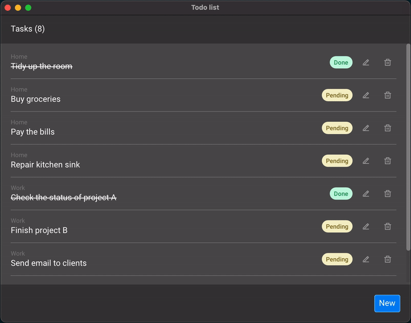

# Example 01 - Todo

## Description

This example implements a really basic Todo list. It allows adding, modifying
and removing Todo items. The objective is showing a more complex example with
user input, sections displayed/hidden depending on the context, and animations.
There is not persistence of any kind.

## Preview

## Interesting bits

Types and UI are split in separate files. This is usually the best approach for
modularity and compilation speed.

The `TodoType` and `TodoStatus` types, both basic algebraic data types, are used
with `textDropdownS`. Helper functions use the fact that both types are Enum
instances to generate the list of all possible values. If you need more control
over how the text of each option is generated, you can use `textDropdown_` and
provide a custom conversion function.

A few colors are defined at the bottom of the UI file and are used to customize
the default themes. You can toggle the commented lines in `customLightTheme` and
`customDarkTheme` to test how a different theme would look like.

The icons provided by the Remix library are used in this example to indicate the
remove and edit actions. Since they are distributed as a .ttf file, they can be
loaded and used in labels or buttons as any other font.

The edit section is displayed/hidden with a slide animation effect. Since slide
animation is unidirectional, two of them with different direction are nested to
provide the desired in/out animations. Each of them is started/stopped by the
event handler according to the current action.
